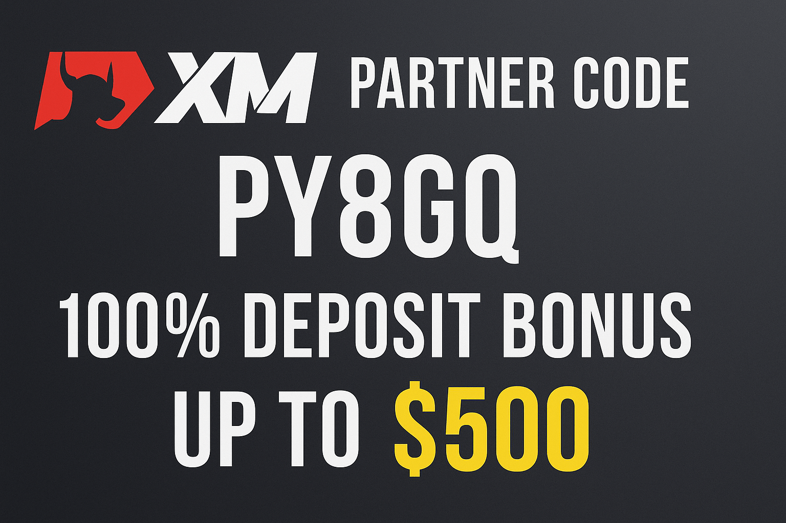

# XM Partner Code PY8GQ explained: How to Use It When Registering



## 🔥 Exclusive Partner Code: **PY8GQ**

Unlock exclusive bonuses when registering with XM Trading using our partner code **PY8GQ**.

**[➡️ CLAIM YOUR BONUSES NOW](https://affs.click/ete87)**

---

## 💰 What You'll Get

### 100% Deposit Bonus (Up to $500)

| Your Deposit | Bonus Amount | Total Trading Capital |
|--------------|--------------|----------------------|
| $100         | $100         | $200                 |
| $250         | $250         | $500                 |
| $500         | $500         | $1,000               |

### $30 No-Deposit Bonus
- ✅ Receive $30 free trading credit after account verification
- ✅ Test the platform and strategies with zero risk
- ✅ No initial deposit required

### 90% LOT Rebate Program
Earn cashback on your trading volume regardless of trade outcomes:

- **EUR/USD**: $5.4 per lot (Standard), $2.7 per lot (Ultralow Standard)
- **XAU/USD**: $6.3 per lot (Standard), $5.4 per lot (Ultralow Standard)

---

## 🚀 How to Use the Partner Code

### Step-by-Step Registration

1. **Visit XM**: Click on our registration link
2. **Register**: Complete the sign-up form with your details
3. **Enter Code**: Input `PY8GQ` in the partner/referral code field
4. **Verify**: Complete the account verification process
5. **Receive Bonuses**: 
   - Get your $30 within 24 hours
   - Deposit bonus applied instantly when you fund your account

### ⚠️ Important Notes

> **Critical**: The partner code must be entered during initial registration. It **cannot** be added to an existing account.

```
Partner Code: PY8GQ
```

---

## 🔍 About XM Trading

XM is a globally recognized broker with over a decade of experience, serving millions of clients across 190+ countries.

### Platform Features
- **Multiple Markets**: Forex, stocks, commodities, indices, and cryptocurrencies
- **Advanced Platforms**: MT4/MT5 with powerful tools and indicators
- **Account Types**: Micro, Standard, and Ultra Low to suit different trading styles
- **Education**: Free webinars, tutorials, and market analysis
- **Support**: 24/5 multilingual assistance in 30+ languages
- **Safety Features**: Negative balance protection and regulated operations

---

## 👥 Who Should Use This Code?

| Trader Type | Benefits |
|-------------|----------|
| **New Traders** | Start risk-free with the no-deposit bonus |
| **Experienced Traders** | Double your capital with the deposit bonus |
| **Copy Traders** | Follow top investors with enhanced funding |
| **All Traders** | Benefit from rebates regardless of outcomes |

---

## ⚖️ Pros & Considerations

### ✅ Advantages
- Generous bonuses with partner code PY8GQ
- Regulated broker with global reputation
- Ultra-fast execution speeds
- No-commission trading on most account types
- Negative balance protection

### ⚠️ Considerations
- Bonuses have trading volume requirements before withdrawal
- Not available in certain countries (including US)
- Limited cryptocurrency selection compared to specialized exchanges
- Some withdrawal methods may incur fees

---

## ❓ FAQ

<details>
<summary><strong>Is there a cost to use this partner code?</strong></summary>

No, the code is completely free to use. XM covers all commissions.
</details>

<details>
<summary><strong>How quickly are bonuses credited?</strong></summary>

The $30 no-deposit bonus is credited within 24 hours after verification. The 100% deposit bonus is applied instantly after funding.
</details>

<details>
<summary><strong>Can I withdraw the bonus money?</strong></summary>

Bonuses have minimum trading volume requirements before withdrawal. Profits can typically be withdrawn according to normal conditions.
</details>

<details>
<summary><strong>Is the code still valid?</strong></summary>

Yes, the code PY8GQ is valid as of May 2025, but offers may change. Use it now to ensure you receive the current benefits.
</details>

---

## 🎯 Quick Start

```bash
# Remember to use partner code during registration
Partner Code: PY8GQ

# Registration Steps:
1. Visit XM registration page
2. Fill out personal information
3. Enter PY8GQ in partner code field
4. Complete verification
5. Start trading with bonuses!
```

---

## 📞 Support

If you need help with registration or have questions about the partner code:

- **XM Support**: 24/5 multilingual assistance
- **Languages**: Available in 30+ languages
- **Contact**: Through XM's official support channels

---

## 📄 Legal Disclaimer

> **Risk Warning**: Trading Forex and CFDs carries significant risk and may not be suitable for all investors. The promotional bonuses are subject to terms and conditions. Never invest money you cannot afford to lose. This content is for informational purposes only and should not be considered financial advice.


**GET STARTED NOW WITH CODE PY8GQ**

